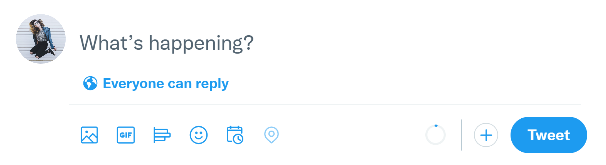

# How to create the new tweet component from Twitter using HTML and CSS

## Link to tutorial video

https://youtu.be/rGt57Hzp0FU

### Resources

| Preview                                                                           | Description          | Location                                             |
| --------------------------------------------------------------------------------- | -------------------- | ---------------------------------------------------- |
|            | Profile Picture      | [Profile picture](./assets/profile-pic.png)          |
|           | Earth Icon           | [Icon of the earth](./assets/icon-earth.png)         |
|                  | Media Icon           | [Media Icon](./assets/icon-media.png)                |
|                      | Gif Icon             | [Gif Icon](./assets/icon-gif.png)                    |
|                    | Poll Icon            | [Poll Icon](./assets/icon-poll.png)                  |
|                  | Emoji Icon           | [Emoji Icon](./assets/icon-emoji.png)                |
|            | Schedule Icon        | [Schedule Icon](./assets/icon-schedule.png)          |
|                      | Geo Icon             | [Geo Icon](./assets/icon-geo.png)                    |
|  | Character Count Icon | [Character Count Icon](./assets/character-count.png) |
